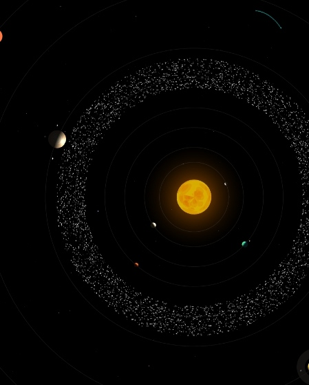
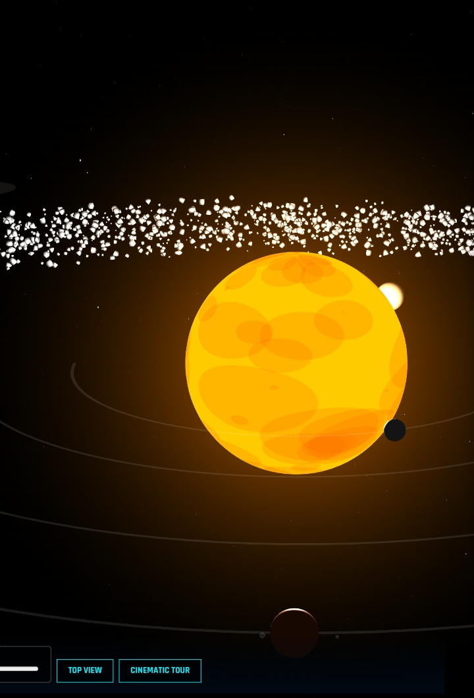

# Solar Engine PRO - 3D Solar System Simulation

<div align="center">
  <table border="0">
    <tr>
      <td style="border: 2px solid #555; padding: 10px; border-radius: 10px;">
        
      </td>
      <td style="border: 2px solid #555; padding: 10px; border-radius: 10px;">
        
      </td>
    </tr>
  </table>

  <br>

  <a href="https://html-3-d-solar-system1.vercel.app/" target="_blank">
    
  </a>
  <a href="https://html-3-d-solar-system1.vercel.app/" target="_blank">
    
  </a>
</div>

**Solar Engine PRO** is a high-performance, interactive 3D simulation of our solar system developed using **Three.js**. It features realistic orbital mechanics, procedural planet textures, and a sleek HUD (Heads-Up Display) for an immersive astronomical experience.


## 🚀 Features

* **Realistic Orbits:** Accurately simulated planetary rotations and orbital paths.
* **Procedural Textures:** Planet surfaces are generated via code (HTML5 Canvas) for a unique look without external image assets.
* **Cinematic Tour:** An automated camera mode that zooms into and follows each planet.
* **Interactive HUD:** Click on any planet to see its physical data, description, and moon systems.
* **Time Warp:** Control the speed of the simulation in real-time.
* **Visual Effects:** Includes a starfield background, asteroid belt, and a dynamic comet with a particle trail.

## 🛠️ Built With

* [Three.js](https://threejs.org/) - 3D WebGL Library.
* [JavaScript](https://developer.mozilla.org/en-US/docs/Web/JavaScript) - Core Logic.
* [HTML5/CSS3](https://developer.mozilla.org/en-US/docs/Web/HTML) - HUD Design and UI.

## 🕹️ Controls

* **Rotate:** Left Click + Drag
* **Zoom:** Mouse Wheel / Pinch
* **Pan:** Right Click + Drag
* **Interact:** Click on any planet to open the data panel.
* **Top View:** Resets camera to a bird's-eye perspective.

## 📂 Installation

1. Clone the repository:
   ```bash
   git clone [https://github.com/your-username/solar-engine-pro.git](https://github.com/your-username/solar-engine-pro.git)
